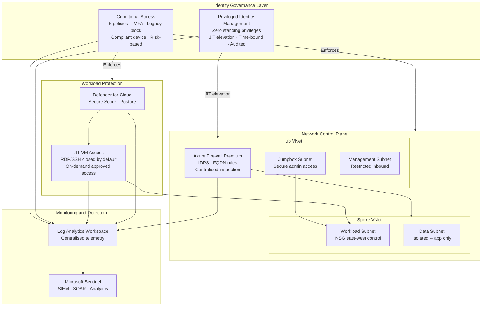

# Zero Trust Enterprise Network (Azure Security Control Plane)

> **Design Study** -- Independent architecture exercise for hybrid enterprise environments. Not associated with a production deployment.

Identity-first Zero Trust enterprise security architecture integrating Conditional Access, PIM, Azure Firewall hub-and-spoke, NSG micro-segmentation, JIT VM access, and Microsoft Sentinel into a unified security control plane.

---

## Architecture Diagram

---

## Executive Summary

Architected a Zero Trust enterprise security architecture on Microsoft Azure, integrating identity governance, privileged access management, centralised network control, workload protection, and security monitoring into a unified security control plane.

The architecture establishes an identity-first security model replacing the traditional network perimeter with identity as the primary trust boundary -- leveraging Conditional Access, PIM, Azure Firewall hub-and-spoke topology, NSG micro-segmentation, JIT VM access, and Microsoft Sentinel aligned to NIST SP 800-207.

---

## Architecture Principles

- Identity as the primary security perimeter -- network location is not a trust signal
- Least-privilege operational access across all administrative and service account roles
- Just-in-Time administrative elevation eliminating standing privilege exposure
- Centralised traffic inspection and governance through a single firewall control plane
- Layered segmentation combining macro-level network isolation and workload micro-segmentation
- Continuous monitoring and telemetry correlation across all security domains
- Defense-in-depth enforcement -- no single control relied upon exclusively
- Policy-driven access through Conditional Access and Azure Policy guardrails
- Auditability by design -- every privileged action and access decision logged

---

## Architecture Layers

### 1. Identity Governance Layer

**Conditional Access Policy Design**

| Policy | Conditions | Grant Controls |
|---|---|---|
| Require MFA -- All Users | All cloud apps, all users | Require MFA |
| Block Legacy Authentication | Legacy auth protocols | Block access |
| Require Compliant Device -- Privileged Access | Azure portal, admin consoles | Require Intune-compliant device |
| Location-Based Access Restriction | Outside trusted named locations | MFA + compliant device |
| High-Risk Sign-In Response | Identity Protection risk: High | MFA + password change |
| Block Unmanaged Devices -- Sensitive Apps | Sensitive workload applications | Hybrid AAD joined or compliant device |

**Privileged Identity Management (PIM)**
- Zero standing privileged role assignments -- eligible roles only
- JIT activation requiring explicit request and written justification
- Approval workflows for high-impact roles (Global Administrator, Security Administrator)
- Time-bound assignments: 1-4 hours maximum activation window
- Comprehensive audit trail: every activation, approval, and role usage event

**PIM and JIT VM Access -- Complementary Controls**
- PIM: identity-layer privilege elevation (Azure RBAC roles in management plane)
- JIT VM Access: infrastructure-layer port governance (RDP/SSH on specific VMs)
- Together: privilege governed at both identity and infrastructure layers for minimum required duration

### 2. Network Control Plane

**Hub-and-Spoke Topology**

Hub VNet:
| Subnet | Purpose | Traffic Control |
|---|---|---|
| AzureFirewallSubnet | Azure Firewall deployment | Centralised ingress/egress inspection |
| ManagementSubnet | Administrative infrastructure | Restricted inbound -- management only |
| JumpboxSubnet | Secure admin access point | Inbound from management subnet only |

Spoke VNet:
| Subnet | Purpose | Traffic Control |
|---|---|---|
| WorkloadSubnet | Application workloads | East-west restricted via NSG |
| DataSubnet | Data tier workloads | Isolated -- application subnet only |

**Azure Firewall Premium**
- Centralised ingress and egress inspection for all hub-and-spoke traffic
- Application rule collections: FQDN-based outbound access control
- Network rule collections: IP and port-based traffic policies
- IDPS: threat-aware traffic inspection
- Diagnostic logging to Log Analytics

**NSG Micro-Segmentation**
- Subnet-level deny-all defaults with explicit allow rules only
- East-west traffic restrictions between workload tiers
- JIT-compatible: management port rules dynamically added/removed
- NSG flow logs for network visibility and forensic investigation

### 3. Workload Protection Layer

**Microsoft Defender for Cloud**
- Continuous Secure Score monitoring across all Azure workloads
- Vulnerability assessment: unpatched systems, misconfigurations, security gaps
- CIS benchmark-aligned hardening guidance
- Threat protection alerts: suspicious activity, anomalous processes
- Azure Policy integration for security baseline enforcement

**Just-in-Time VM Access**
- RDP (3389) and SSH (22) blocked by default -- no standing port exposure
- JIT request: user justification + defined access duration required
- Approved JIT: port opened for requesting source IP only, for approved duration only
- Automatic closure after access window expiry -- no manual cleanup
- Complete audit trail: request, approval, access, closure

### 4. Monitoring and Detection Layer

**Azure Monitor and Log Analytics**
- Centralised telemetry: Entra ID logs, Firewall logs, NSG flow logs, Defender alerts, VM activity
- Unified security data platform enabling cross-domain query and correlation
- Azure Policy diagnostic enforcement -- all resources forward logs consistently

**Microsoft Sentinel**
- SIEM ingesting all centralised Log Analytics telemetry
- Analytics rules: identity abuse, privilege escalation, network anomalies
- Incident correlation: identity + network + workload events unified
- SOAR playbooks: account containment, IP blocking, SOC notification
- Zero Trust coverage dashboard: CA effectiveness, PIM activation patterns

**Azure Policy Governance**
- Audit and deny policies preventing non-compliant resource deployment
- Security baseline configuration enforcement across all resources
- Compliance dashboard: continuous governance visibility and drift detection

---

## Design Decisions

### ADR-001 -- PIM over Static RBAC
**Decision:** Zero standing privileges via PIM JIT elevation
**Rationale:** Permanent active RBAC assignments create standing high-value targets. A compromised credential provides immediate unrestricted access. PIM makes privilege elevation explicit, time-bound, and audited -- dramatically reducing blast radius of credential compromise.
**Trade-off:** Deliberate friction in administrative workflows. Mitigated through appropriate activation window sizing and clear operational procedures.

### ADR-002 -- Hub-and-Spoke with Centralised Firewall
**Decision:** All traffic through central Azure Firewall inspection point
**Rationale:** Flat networks allow unrestricted lateral movement after compromise. Hub-and-spoke forces all inter-spoke and external traffic through Azure Firewall -- providing consistent governance, centralised logging, and single policy enforcement boundary.
**Trade-off:** Throughput bottleneck for high-bandwidth workloads. Azure Firewall Premium: 100 Gbps. High-throughput environments should evaluate Azure Virtual WAN.

### ADR-003 -- Layered Segmentation (Firewall + NSGs)
**Decision:** Azure Firewall for north-south + NSGs for east-west micro-segmentation
**Rationale:** Azure Firewall and NSGs provide complementary capabilities. Firewall governs north-south with application-layer awareness. NSGs enforce east-west within spoke subnets at workload level. Neither alone achieves the same depth.
**Trade-off:** NSG rule complexity at scale. Mitigated through IaC (Terraform/Bicep) and Azure Policy enforcement.

### ADR-004 -- Conditional Access as Primary Access Enforcement
**Decision:** Identity-based access decisions replacing network location trust
**Rationale:** Network location is no longer reliable in hybrid/cloud environments. CA evaluates identity, device health, location, and risk at every authentication event -- enforcing access based on verified context per NIST SP 800-207.
**Trade-off:** Legacy apps using NTLM/Kerberos/basic auth cannot be governed by CA. Requires legacy authentication migration planning before aggressive blocking.

### ADR-005 -- JIT VM Access for Management Ports
**Decision:** RDP/SSH closed by default, on-demand approved access only
**Rationale:** Standing open management ports are continuously probed by automated scanners. JIT eliminates standing exposure -- ports opened only for approved source IP, approved duration. Combined with PIM for layered privilege governance.
**Trade-off:** Activation latency for emergency access. Mitigated through documented emergency access procedures.

---

## Technologies

| Category | Technologies |
|---|---|
| Identity and Governance | Microsoft Entra ID · Conditional Access · PIM |
| Network Security | Azure Firewall Premium · Azure VNet · NSGs · Hub-and-Spoke |
| Workload Protection | Microsoft Defender for Cloud · JIT VM Access |
| Governance Enforcement | Azure Policy |
| Monitoring and SIEM | Azure Monitor · Log Analytics · Microsoft Sentinel |
| Automation | PowerShell · Azure CLI · Terraform |
| Compliance | NIST SP 800-207 · CIS Controls v8 · ISO 27001 |

---

## Compliance Mapping

| Control | Framework | Implementation |
|---|---|---|
| Identity verification | NIST SP 800-207 Tenant 1 | Conditional Access -- verify explicitly |
| Least privilege access | NIST SP 800-207 Tenant 2 | PIM JIT -- least privilege access |
| Assume breach | NIST SP 800-207 Tenant 3 | Sentinel · Defender · JIT -- assume breach |
| Privileged access | CIS Control 5 | PIM zero standing privileges |
| Access control | CIS Control 6 | Conditional Access · RBAC |
| Audit logging | CIS Control 8 | Log Analytics centralised telemetry |
| Network monitoring | CIS Control 13 | NSG flow logs · Firewall diagnostics |
| Account monitoring | ISO 27001 A.9.2 | PIM audit trail · CA sign-in logs |
| Network segmentation | ISO 27001 A.13.1 | Hub-and-spoke · NSG micro-segmentation |

---

## Repository Structure

zero-trust-enterprise-network/
├── terraform/
│   ├── modules/
│   │   ├── hub-networking/
│   │   ├── spoke-networking/
│   │   ├── azure-firewall/
│   │   ├── conditional-access/
│   │   └── monitoring/
│   └── environments/
│       └── prod/
├── runbooks/
│   ├── Enable-PIMRole.ps1
│   ├── Request-JITAccess.ps1
│   └── Get-ZeroTrustComplianceReport.ps1
├── kql/
│   ├── pim-activation-monitoring.kql
│   ├── jit-access-audit.kql
│   └── firewall-threat-detection.kql
├── docs/
│   ├── architecture.md
│   ├── compliance-mapping.md
│   └── conditional-access-design.md
└── pipelines/
    └── azure-pipelines.yml

---

## Future Evolution

- UEBA integration for advanced insider threat and compromised account detection
- Automated risk-based Conditional Access using real-time Identity Protection risk scores
- Azure Virtual WAN migration for improved hub-and-spoke scalability
- Adaptive micro-segmentation through Azure Network Manager
- IaC governance through Bicep and Azure Policy for consistent, auditable deployment
- Microsoft Security Copilot integration for AI-assisted incident investigation
- Cross-cloud Zero Trust expansion to AWS and GCP workloads

---

*Part of the [sergeksfumey](https://github.com/sergeksfumey) infrastructure architecture portfolio · [sergeksfumey.com](https://sergeksfumey.com)*
